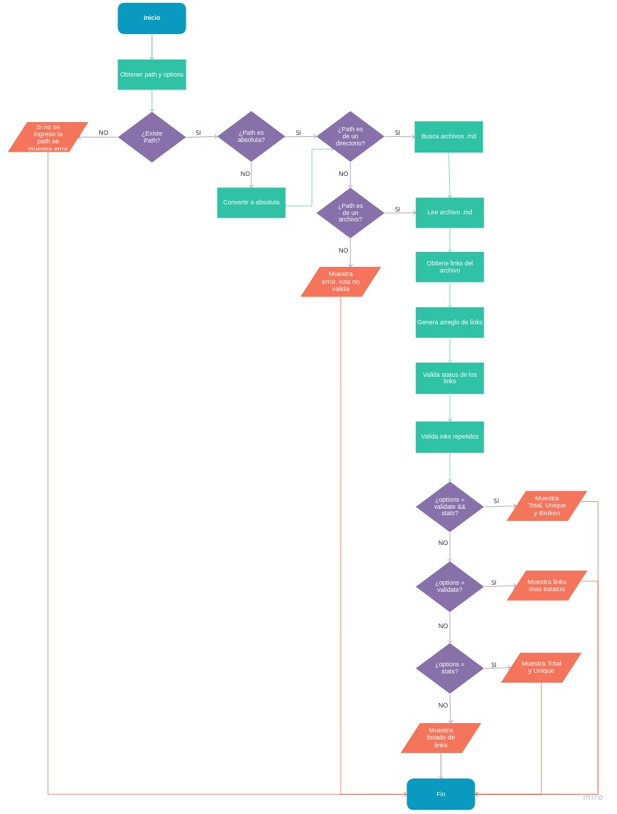

# librería mdlinks-dlmp

[Markdown](https://es.wikipedia.org/wiki/Markdown) es un lenguaje de marcado
ligero. Es usado en muchísimas plataformas que manejan texto plano, y es muy común
encontrar varios archivos en ese formato en cualquier tipo de repositorio
(empezando por el tradicional `README.md`).

Estos archivos `Markdown` normalmente contienen _links_ (vínculos/ligas) que
muchas veces están rotos o ya no son válidos y eso perjudica mucho el valor de
la información que se quiere compartir.

*mdlinks-dlmp* te permite leer los archivos Markdown e identificar los links que contiene dicho archivo, mediante comandos el usuario puede solicitar ver el listado de links o bien estadísticas del número de links existentes en el archivo o el número de links rotos.

## Diagrama de flujo



## Documentación técnica

la librería ofrece la siguiente interfaz:

#### `md-links <path-to-file> [options]`

##### Argumentos

- `path`: Ruta absoluta o relativa al archivo o directorio.
- `options`: Un objeto con las siguientes propiedades:
  - `validate`: Indica si se desea validar los links encontrados.
  - `stats`: Indica si se dedea mostrar las estadisticas de los links encontrados.

##### Valor de retorno

1. El comportamiento por defecto identifica el archivo markdown (a partir de la ruta que recibe como argumento), analiza el archivo Markdown e imprime los links que vaya encontrando, junto con la ruta del archivo donde aparece y el texto que hay dentro del link (truncado a 50 caracteres).

- `href`: URL encontrada.
- `text`: Texto que aparece dentro del link.
- `file`: Ruta del archivo donde se encontró el link.

2. Si pasamos la opción `--validate` o `v`, la librería hace una petición HTTP para
averiguar si el link funciona o no. Si el link resulta en una redirección a una
URL que responde ok, entonces consideraremos el link como ok, mostrando esta respuesta en pantalla.

- `href`: URL encontrada.
- `text`: Texto que aparece dentro del link.
- `file`: Ruta del archivo donde se encontró el link.
-  `status-link`: El status de la respuesta recibida de la petición HTTP a dicha URL.

3. Si pasamos la opción `--stats` o `-s`, el output (salida) es un texto con estadísticas
básicas sobre los links.

- `Total`
- `Unique`

4. También podemos combinar `--stats` y `--validate` o `-s -v`, para obtener estadísticas que
muestran además los links rotos.

- `Total`
- `Unique`
- `Broken`

## Guía de uso e instalación de la librería

### Instalación

Para realizar la instalación de la librería deberá usar la línea de comando siguiente:

`$ npm install mdlinks-dlmp`

### Uso de la librería

Para ejecutar la librería debera hacerlo de la forma siguiente:

* Para obtener el listado de todos los links de los archivos .md contenidos en un directorio determinado, utilizar la línea de comando:

`$ mdlinks <ruta-a-directorio>`

Obtendra un resultado similar a este:

```sh
$ mdlinks ./test/prueba/
oyectos/CDMX007-fe-md-links/test/prueba/README2.md https://code.visualstudio.com/ Visual Code
oyectos/CDMX007-fe-md-links/test/prueba/README3.md https://www.sublimetext.com/ Sublime Text
oyectos/CDMX007-fe-md-links/test/prueba/README3.md https://github.com/Laboratoria/curricula-js/tree/v2.x/topics/shell UNIX Shell
oyectos/CDMX007-fe-md-links/test/prueba/README4.md https://github.com/Laboratoria/curricula-js/tree/v2.x/topics/scm/01-git git
```

* Para obtener el listado de todos los links identificados en el archivo Markdown, utilizar la línea de comando:

`$ mdlinks <ruta-a-archivo>`

Obtendrá un resultado similar a este:

```sh
$ mdlinks ./test/prueba/README3.md
oyectos/CDMX007-fe-md-links/test/prueba/README3.md https://code.visualstudio.com/ Visual Code
oyectos/CDMX007-fe-md-links/test/prueba/README3.md https://www.sublimetext.com/ Sublime Text
oyectos/CDMX007-fe-md-links/test/prueba/README3.md https://github.com/Laboratoria/curricula-js/tree/v2.x/topics/shell UNIX Shell
```

* Para obtener el listado de todos los links identificados en los archivos Markdown, incluyendo la validación del estatus de los links encontrados, ingresar la siguiente línea de comando:

`$ mdlinks <ruta> --validate` ó `$ mdlinks <ruta> -v`

Obtendrá un resultado similar a este:

```sh
$ mdlinks ./test/prueba/README4.md --validate
oyectos/CDMX007-fe-md-links/test/prueba/README4.md https://es.wikipedia.org/wiki/Markdown OK 200 Markdown
oyectos/CDMX007-fe-md-links/test/prueba/README4.md https://es.wikipedia.org/wiki/Markdown OK 200 Markdown
oyectos/CDMX007-fe-md-links/test/prueba/README4.md https://es.wikipedia.org/wiki/Markdwn Not Found 404 Markdown
```

* Para obtener las estadísticas de los links encontrados, ingresar la siguiente línea de comando:

`$ mdlinks <ruta> --stats` ó `$ mdlinks <ruta> -s`

Obtendrá un resultado similar a este:

```sh
$ mdlinks ./test/prueba/README4.md -stats
Total: 3
Unique: 2
```

* Para obtener las estadísticas de los links encontrados incluyendo el conteo de los links rotos, ingresar la siguiente línea de comando:

`$ mdlinks <ruta> --stats --validate` ó `$ mdlinks <ruta> -s -v`

Obtendrá un resultado similar a este:

```sh
$ mdlinks ./test/prueba/README4.md -s -v
Total: 3
Unique: 2
Broken: 1
```
